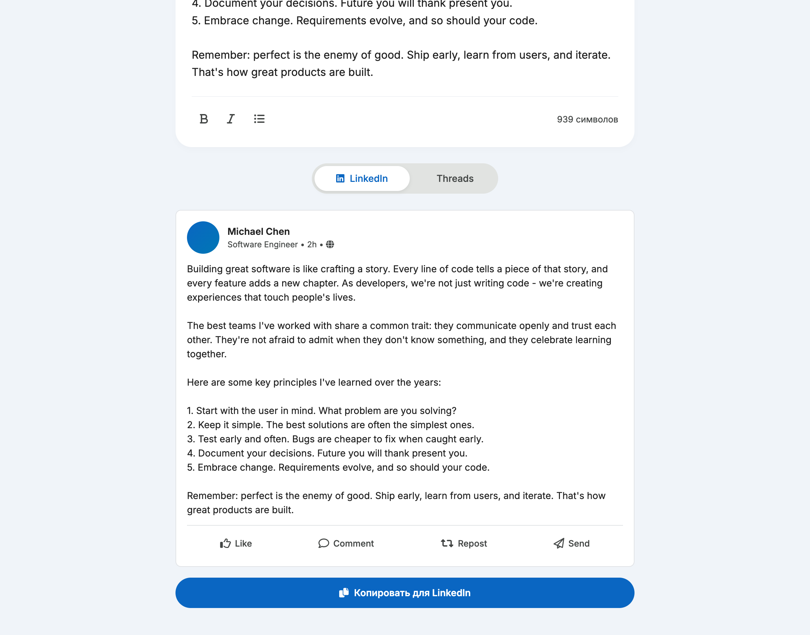
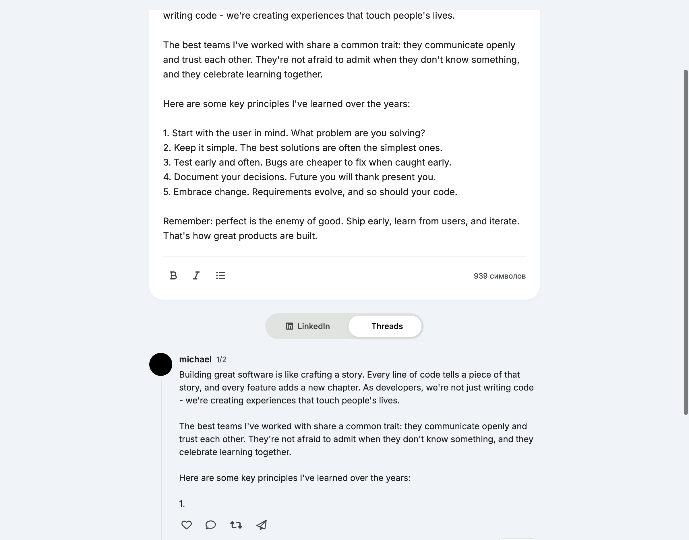

# Post Formatter для LinkedIn & Threads

SPA для форматирования постов в социальные сети с Unicode-стилизацией и автоматическим разбиением на треды.




## 🚀 Возможности

- **Unicode-форматирование** — жирный и курсив для латинских символов
- **Автоматическое разбиение** — умное деление постов на треды по 500 символов
- **Маркированные списки** — добавление буллетов к тексту
- **Live Preview** — реалтайм превью для LinkedIn и Threads
- ~~**Черновики** — сохранение и управление черновиками (отключено)~~
- **Адаптивный дизайн** — работает на десктопе и мобильных

## 📦 Структура проекта

```
/LinkedIn:Threads
├── docs/                   # Документация
│   ├── CLAUDE.md           # Конфигурация проекта
│   ├── Main Requirements.md # Полная спецификация
│   └── future_scope.md     # Планы на V2
├── assets/                 # Скриншоты и изображения
├── index.html              # Главная страница
├── styles.css              # CSS стили (Material 3)
└── app.js                  # JavaScript логика
```

## 🛠 Технологии

- **Frontend:** HTML5, CSS3, Vanilla JavaScript
- **Design:** Material 3 Design System
- **Fonts:** Inter (Google Fonts)
- **Icons:** Font Awesome 6

## 🎯 Запуск

Для локальной разработки:

```bash
# Python 3
python3 -m http.server 8080

# Или любой другой статический сервер
npx serve
```

Откройте http://localhost:8080

## 📝 Использование

1. **Напишите текст** в редакторе
2. **Выделите текст** и примените форматирование:
   - 𝐁𝐨𝐥𝐝 (только латиница)
   - 𝘐𝘵𝘢𝘭𝘪𝘤 (только латиница)
   - • Списки
3. **Переключайтесь** между превью LinkedIn и Threads
4. **Копируйте** готовый текст одной кнопкой

## ⚠️ Важно

- Unicode-форматирование работает **только для латиницы** (a-z, A-Z)
- Кириллические символы остаются без изменений
- Threads автоматически делится на части по 500 символов

## 🗺 Roadmap

### MVP (V1) ✅
- [x] Базовый UI
- [x] Unicode форматирование
- [x] Thread splitting
- [x] LinkedIn/Threads preview
- [x] Copy to clipboard
- ~~[ ] Supabase интеграция~~ (отключено)
- ~~[ ] Управление черновиками~~ (отключено)

### V2 (Planned)
- [ ] Ручное разбиение тредов `///`
- [ ] Аутентификация (Owner Mode)
- [ ] Локализация RU/EN
- [ ] Экспорт в PDF/Image

## 📄 Лицензия

MIT

## 👤 Автор

Разработано с помощью Claude Code
